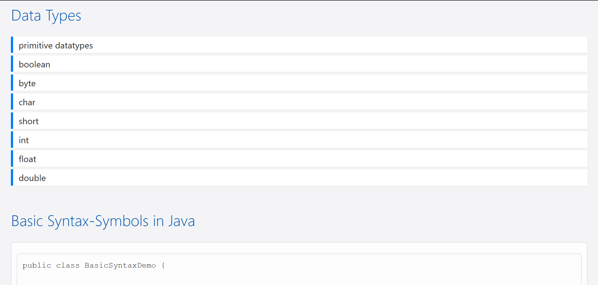

# Learning Website: Basics of Java

This repository contains a webpage that explains the basics of development with Java.

## Preview

## Live Demo
The webpage can be viewed here: [Live Demo](https://rawcdn.githack.com/KLubina/learning-website-basics-of-java/61cfb87046c83bad853a9446a2469b174bb4d30b/index.html)

## Contents
The webpage covers fundamental concepts of development with Java, including:
- Introduction to Java
- Key syntax and concepts
- Example code and explanations